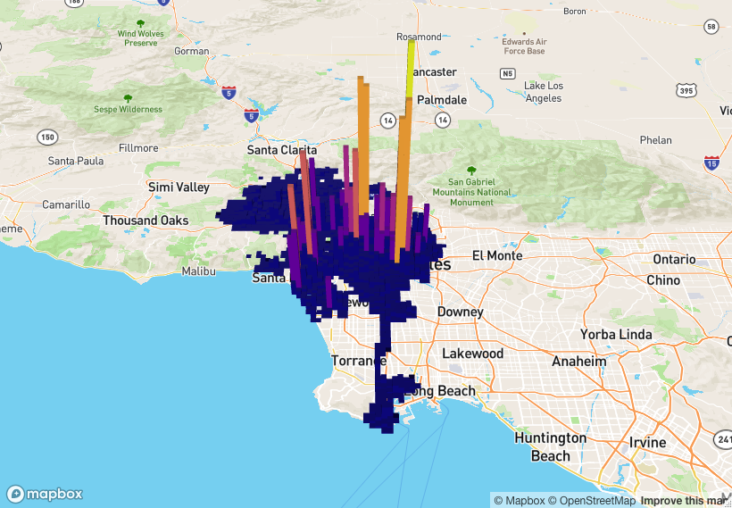

```{r setup, include=FALSE, message=FALSE, warning=FALSE}
#library(usethis)
library(ggmap)
library(rgdal)
library(here)
library(proj4)
library(magrittr)
library(dplyr)
library(ggplot2)
library(cowplot)
library(magick)
library(png)
library(ggimage)
library(mapdeck)
library(osmdata)
library(maps)
#library(sf)
library(grid)
library(gridBase)
library(knitr)

Parking_Citations <- readRDS(file = "Parking_Citations.rds")
```

   
\newpage

## Introduction  
   Alex, Anushi, Matt and Griffin all come from different backrounds and majors, so in disucssions for which dataset we wanted to analyze, we explored a wide range of topics from public health to the New York City subway We eventually decided to take on data from another large metropolis, but this time in sunny Los Angeles. In Los Angeles, the beautiful beaches, countless celebrities, and hollywood homes are magical for visitors. However, LA traffic is often very bad and parking in tourist areas can be a nightmare. As the second largest city in the United States, there are over 6.4 million vehicles in the Los Angeles urbanized area^1^. Our dataset, Parking_Citations, contains all the details of nearly 10 million parking violations in Los Angeles from 2010 to the present. That means we have access to the records that account for fines totalling close to $600 million. With so much money at stake and the huge volume of data, the city of Los Angeles keeps track of these records electronically. We intend to take this massive amount of data and transform it so that the intricacies of parking violations can be easily understood.  

```{r 3D Heatmap, echo=FALSE, message=FALSE, warning=FALSE, cache=TRUE}
if(knitr::is_html_output()){
set_token(Sys.getenv("MAPBOX"))
mapdeck(pitch = 45, zoom = 100) %>%
  add_grid(data = Parking_Citations[1:30000,], lat = "real_lat", lon = "real_lng", 
           cell_size = 1000, elevation_scale = 50, layer_id = "grid_layer",
           colour_range = viridisLite::plasma(6))} 
```

```{r 3D_Map, echo=FALSE, out.width="0.85\\linewidth", out.height="0.85\\linewidth", fig.align="center", message=FALSE, warning=FALSE, cache=TRUE}
if(!knitr::is_html_output()) { }
```

  
##### Big Data  
  The raw data was accessed directly from the City of Los Angeles Department of Transportation (LADOT) through the city's Open Data website^2^. The original data set contained 9.97 million rows, each containing details on one parking violation. We identified the fine amount and location data as the most important variables and therefore removed all rows containing empty or NA values in those two columns. This narrowed the amount of rows to about 8.5 million. LADOT uses US Feet coordinates according to the NAD_1983_StatePlane_California projection, which is not easily comparable to standard latitude and longitude values, so our next step was to use **sp** package for R to transform our location data. Our final cleaned data set contained data on 8,502,692 tickets, including information of the time, date, location, vehicle information, parking offense, and more. Although well over the 1 milion row minimum requirement, this large amount of data will allow us to explore the trends in parking violations in LA over a relatively large time frame.  
   
   
***   
#### Overview graphs

```{r, echo=FALSE, message=FALSE, warning=FALSE, cache=TRUE}
#### number of fines per year

Parking_Citations%>% 
mutate(Year=format(as.Date(Issue.Date, format="%m/%d/%Y"), format=("%Y"))) ->Parking_Citations
Parking_Citations$Year <- as.integer(Parking_Citations$Year)
                                     
Parking_Citations %>%
  group_by(Year) %>%
  summarise(count=n())->df
x <- df$Year
y <- df$count


grid.newpage()
pushViewport(plotViewport(margins = c(5.1, 4.1, 4.1, 2.1)))
pushViewport(dataViewport(x, y))
grid.rect(gp=gpar(fill="yellow", alpha=.7))
grid.text(label="Parking Citations By Year",x=.5, y=1.05, gp=gpar(fontface="bold", cex=1.5))
grid.xaxis(at=x)
grid.yaxis(at=y, gp=gpar(cex=.8))
grid.lines(x,y, default.units = "native", gp=gpar(lty=8, col="red", lwd=3))
grid.points(x[1:7], y[1:7], pch=24, size=unit(0.025, "npc"), gp=gpar(fill="red"))
grid.points(x[8:11], y[8:11], pch = 25, size=unit(0.025, "npc"), gp=gpar(fill="green"))
popViewport(2)
```

When we began our analysis, we had to get some idea of what we were dealing with. With no instructions, We first boiled down the data into a more understandble form. The data gave us a good amount of information, and it also gave us a good starting point. The data showed a skewed distrubution over 11 year span. From 2010 to 2014 there were less than 40 parking citations recorded. In 2014 that number increased to 34,000. After that, we saw a drastic 44 percent change into 2015, when 1,541,535 parking citations were recorded. The count peaked at 2,154,321 citations in 2017. This peak accentuated both the steep rise leading up to 2017 and also the suprisingly steep decline afterwards. While this graph gave us a good handle on the numbers, there were questions unanswered about the data collection.The  drastic increase from 2014-2015 may be explained by an attempt by the City of Los Angeles to digitize their citations. But that explanation is contradicted by the equally sharp decline after 2017. This left the question of how many citations did they actually collect? The graph didn't tell us exactly, but it gives us a range of values that captures the true value or something close. Even without the actual answer, this graph highlighted the magnitude of the citaitons in LA.
#### Basic Graphs
```{r dollars per year, echo=FALSE, message=FALSE, warning=FALSE, cache=TRUE}
data.frame(Year=c(seq(from=2010, to=2020, by=1), "Total"),
         "Dollars_Collected" =c(730, 630, 2276, 3062, 2371400, 107172874, 130124585,151608139,124738695,75291586,2275, sum(c(730, 630, 2276, 3062, 2371400, 107172874, 130124585,151608139,124738695,75291586,2275))))%>%knitr::kable()

Parking_Citations%>%
  group_by(Violation.Description)%>%
  summarise(count=n())->violations
##price of most violated and then max fine amount


data.frame(Top_Violations= c("NO PARK/STREET CLEAN", "METER EXP", "RED ZONE"), Count=c(2389114, 1634877, 635504), fine_amount=c(73,63,93)) %>%
  knitr::kable()
## red curb just means no stopping, parking, or standing 

##maximum fine
Parking_Citations%>%
 select(Violation.Description, Fine.amount)%>%
  filter(Fine.amount ==1100)%>%
  filter(Violation.Description=="DP- RO NOT PRESENT")%>%head(1)%>%knitr::kable()

## the maximum fine amount is for parking in a disabled parking spot with no DP registration


## what are the hotspots
Parking_Citations %>%
  select(Location)%>%
  group_by(Location)%>%
  summarise(count=n())%>%
  arrange(desc(count))%>%
  head(10)%>% knitr::kable()


```
    
  Los Angeles is not just a city with horrible traffic, it's also a city where it is terribly hard to park, especially in tourist areas, shopping districts, or other special zones. Over the past decade, The City of Los Angeles collected $591,316,252 digitally. The amount of dollars collected mimicks the movement in the previous graph of citations byt year Our Top_Violations table explains that the top three violations are parking in a street clean area, parking with an experied meter, and parking in a red zone. Street Cleaning happens every day in Los Angeles, albeit on different sides of the roads depending on the day of the week. Because the side of the street that is cleaned changes on a daily bases, many people are caught parking on the wrong side of the road and are penalized. People who are in a hurry, who do know the law, sometimes ignore it or assume that the street cleaner has passed or won't come and are also penalized frequently. Parking in a red zone is The City of Los Ageles's third most frequently cited violation. A red curb, or red zone, indicates no parking, standing or stopping for public safety reasons^3^.  Parking violations vary in their severity. Violating a red zone parking law is a public safety issue, so the fine is more expensive than that of a meter experation ticket, which is stil very expensive! At the very least, do not get caught parking in a disabled vehicle designated spot without reason. That fine will cost you 1100 dollars. 
  Parking citations by location indicated where the most violations have occured. These violations happen in major hotspots of the city which have heavy tourist footraffick and very little space. The lack of parking forces people to park in residential areas, where there are high chances of fines. 1301 ELectric Ave is a street where people park to visit Long Beach, California's famous Seal Beach. Irving Court is very close to a the Venice Beach boardwalk and the Abbot Keny shopping district. Hawthorne Avenue is the spot just south of the bustling Hollyword Blvd. Among these hotspots is also The Griffith Observatory. These Los Angeles must sees attract more cars and tourists than an area can hold and so are, unsuprisingly, the locations with the most cited violations.


```{r cleanup, eval=FALSE, include=FALSE, echo=FALSE, message=FALSE, warning=FALSE, cache=TRUE}
#Average fine amount by year
Parking_Citations %>%
  filter(!is.na(Issue.Date), !is.na(Fine.amount)) %>%
  mutate(year = substring(Issue.Date, 7, 10))%>%
  group_by(year) %>%
  summarise(avg = mean(Fine.amount), count = n())%>%
  filter(count > 20000)%>% 
  ggplot() + aes(x = year, y = avg) + geom_histogram(stat = "identity") +
  theme(axis.text.x.bottom = element_text(hjust = 1, angle = 45, size = 8))
```

## Who receives parking citations?

  Parking citations and violations seem to be universal, affecting every vehicle on the road all the same. But with access to such large amounts of data, we wanted to know whether all vehicles had the same chance of recieving a parking violation. 

```{r, echo=FALSE, warning=FALSE, message=FALSE, cache=TRUE}
ggplot(map_data("state")%>%left_join(Parking_Citations%>%group_by(RP.State.Plate)%>%summarise(count = n())%>%left_join(read.csv('statename.csv'))%>%filter(!is.na(region), region != "california"))) + aes(long, lat, group = group) +
  geom_polygon(aes(fill = count), color = "white") + scale_fill_viridis_c(option = "C") + theme_void() + theme(legend.position = c(.11, .165)) +
  labs(fill = "Number of Citations", title = "Number of Citations for Vehicles with Out of State Registration")
```

  Although only around 1.5 million out of the 8.5 million violations we looked at were for out-of-state vehicles, we wanted to know what the distribution of these vehicles was. The fact that Arizona had the highest count seems logical given its close proximity to LA. This same reasoning could also explain the high concentration of vehicles from both Nevada and Texas. Although Oregon and Washington border the opposite side of California, the overall increased travel between the west coast states could account for these findings. On the other hand, the obvious outlier Florida was much higher than its neighboring states but this could either be coincidental or due to the higher volume of travel from this state. 

```{r, echo=FALSE, message=FALSE, warning=FALSE, cache=TRUE}
#Average fine amount by car Color
Parking_Citations %>% 
  filter(!is.na(Fine.amount), !is.na(Color)) %>%
  group_by(Color) %>%
  summarise(count = n()) %>%
  subset(Color == "RD" | Color == "GY" | Color =="WH" | Color == "BL" | Color == "BK" | Color == "BN") %>% 
  ggplot() + aes(x = Color, y = count, fill = Color) + geom_histogram(stat = "identity") +
  labs(title = "Total Parking Violations by car color", x = "Car Color", y = "Total Parking Violations") +
  theme(legend.position = "none") +
  scale_x_discrete(labels = c("Black", "Blue", "Brown", "Gray", "Red", "White")) +
  scale_fill_manual(values = c("Black", "Blue", "#8B4513", "Gray", "Red", "White"))
```

  We have heard before that cars with bright colors, such as red, are more likely to get pulled over due to their high visibility on the road. In order to investigate whether there was any such color-bias when it came to parking violations we looked at the total number of violations by car color. In order to perform this analysis we manually picked 6 of the most common car colors. Since the distribution of count seemed to vary with the typical distribution of car colors we are used to seeing on the road, with colors like black and gray having the highest counts, we concluded that there was no significant impact on the likelihood of a parking violation based on the color of a car. 

```{r, echo=FALSE, warning=FALSE, message=FALSE, cache=TRUE}
#Average fine by Make of car 
Parking_Citations %>% 
  filter(!is.na(Fine.amount)) %>%
  group_by(Make) %>%
  summarise(avg = mean(Fine.amount), count = n())%>%
  filter(count > 50000) %>%
  ggplot() + aes(x = Make, y = avg, fill = ..x..) + geom_histogram(stat = "identity") +
  theme(panel.background = element_rect(fill = "gray75"),
        legend.position = "none") +
  labs(title = "Average Fine Amount by Manufacturer", x = "Manufacturer", y = "Average Fine Amount ($)") +
  scale_fill_gradient(low = "Light Sky Blue", high = "Navy Blue") +
  coord_flip() +
  scale_x_discrete(labels = c("Acura", "Audi", "BMW", "Cadillac", "Chevy", "Chrysler", "Dodge", "Ford", "GMC", "Honda", "Hyundai", "Infinity", "Jeep", "Kia", "Lexus", "Land Rover", "Mazda", "Mercedez", "Mitsubishi", "Mini Cooper", "Nissan", "Other", "Subaru", "Toyota", "Volkswagon", "Volvo"))

```

  Although so far it seemed like there was a surprising amount of equality in the chances of various cars recieving parking violations, we wanted to look deeper into the actual manufacturers of the cars. We wondered if perhaps more expensive cars might be getting higher fines. So, grouped the cars by manufacturer and looked at the average fine amount of all the cars in groups greater than 50,000 violations. Given the fact that we represented over 8 million rows of data, even small fluctuations could be pretty significant. However when we looked at the highest averages of fine amounts, we saw that the Other category was highest followed by GMC, Kia and Nissan, none of which were considered very expensive. The lowest average was also BMW, which was known to be a more expensive manufacturer. The peak of the Other category could mean something given that this category might contain smaller less standard cars but this would also make sense if we assumed that the less standard cars were also more expensive. 

```{r, echo=FALSE, warning=FALSE, message=FALSE, cache=TRUE}
#Average fine by Body.Style

grid.newpage()
pushViewport(viewport(layout = grid.layout(2, 2)))

a <- Parking_Citations %>% 
  filter(!is.na(Fine.amount)) %>%
  group_by(Body.Style) %>%
  summarise(avg = mean(Fine.amount), count = n()) %>%
  subset(Body.Style == "TR" | Body.Style == "PU" | Body.Style == "VN" | Body.Style == "SV" | Body.Style =="SU" | Body.Style == "SD" | Body.Style == "CP" | Body.Style == "RD" | Body.Style == "CV" | Body.Style == "HA" | Body.Style == "SW") %>% 
  ggplot() + aes(x = Body.Style, y = avg, fill = ..x..) + geom_histogram(stat = "identity") +
  theme(panel.background = element_rect(fill = "gray75"),
        legend.position = "none",
        axis.text.x.bottom = element_text(hjust = 1, angle = 45, size = 8)) +
  labs(x = "Standard Personal Vehicles", y = "Average Fine Amount ($)") +
  scale_fill_gradient(low = "Light Sky Blue", high = "Navy Blue") + 
  scale_x_discrete(labels = c("Coupe", "Convertible", "Hatchback", "Pick-up", "Roadster", "Sedan", "SUV", "Sports Van", "Station Wagon", "Truck", "Van"))

b <- Parking_Citations %>% 
  filter(!is.na(Fine.amount)) %>%
  group_by(Body.Style) %>%
  summarise(avg = mean(Fine.amount), count = n()) %>%
  subset(Body.Style == "AM" | Body.Style =="TT" | Body.Style == "FO" | Body.Style == "BU" | Body.Style == "LM" | Body.Style == "TN") %>% 
  ggplot() + aes(x = Body.Style, y = avg, fill = ..x..) + geom_histogram(stat = "identity") +
  theme(panel.background = element_rect(fill = "gray75"),
        legend.position = "none",
        axis.text.x.bottom = element_text(hjust = 1, angle = 45, size = 8),
        axis.title.x = element_blank()) +
  labs(x = "Professional Vehicles") +
  scale_fill_gradient(low = "Light Sky Blue", high = "Navy Blue") +
  scale_x_discrete(labels = c("Ambulance", "Bus", "Forklift", "Limo", "Tanker", "Trailer"))

c <- Parking_Citations %>% 
  filter(!is.na(Fine.amount)) %>%
  group_by(Body.Style) %>%
  summarise(avg = mean(Fine.amount), count = n()) %>%
  subset(Body.Style == "MH" | Body.Style =="MC" | Body.Style == "MS" | Body.Style == "GC" | Body.Style == "MD") %>% 
  ggplot() + aes(x = Body.Style, y = avg, fill = ..x..) + geom_histogram(stat = "identity") +
  theme(panel.background = element_rect(fill = "gray75"),
        legend.position = "none",
        axis.text.x.bottom = element_text(hjust = 1, angle = 45, size = 8)) +
  labs(x = "Non-standard Personal Vehicles", y = "Average Fine Amount ($)") +
  scale_fill_gradient(low = "Light Sky Blue", high = "Navy Blue") +
  scale_x_discrete(labels = c("Golf Cart", "Motorcycle", "Moped", "Motor Home", "Motor Scooter"))

print(a, vp = viewport(layout.pos.row = 1))
print(b, vp = viewport(layout.pos.row = 2, layout.pos.col = 2))
print(c, vp = viewport(layout.pos.row = 2, layout.pos.col = 1))

popViewport(1)
```

  Although a large majority of the vehicles was relatively standard personal vehicles, the dataset also contained non-standard personal vehicles, such as Golf Carts or Motorcycles and also more professional vehicles, such as ambulances or limos that were typically not personal vehicles and used for a more professional purpose. In order to analyze the fine amount at from another angle, we manually categorized 22 of the vehicle types into these three categories and lookes at the trend. While convertibles were a clear outlier in the standard personal vehicles category this could likely be a coincidence due to the low overall count of these vehicles. Furthermore, mopeds had one of the lowest averages which could be explained by the fact that they may incur less significant violations due to the nature of the vehicle.

```{r, echo=FALSE, warning=FALSE, message=FALSE, cache=TRUE}
#Violation Description by Body Style Description
Parking_Citations %>%
  filter(Body.Style.Description != "", !is.na(Violation.Description)) %>%
  subset(Violation.Description == "NO PARK/STREET CLEAN" | 
           Violation.Description == "METER EXP." | 
           Violation.Description == "RED ZONE" | 
           Violation.Description == "PREFERENTIAL PARKING" | 
           Violation.Description =="DISPLAY OF TABLS" | 
           Violation.Description == "NO PARKING") %>% 
  ggplot() + 
  aes(x = Body.Style.Description, fill = Violation.Description) +
  geom_bar(position = "fill") + 
  labs(title = "Percent of Different Violations by Vehicle Type", x = "Vehicle Type", y = "Proportion of Violation Type") +
  coord_flip()

```

  Finally we wanted to look at the various types of vehicles on a higher level. We wondered if perhaps the type of vehicle would impact the frequency of different types of violations. In order to make this analysis more feasible, we took subsetted the rows with the 6 most frequent types of violations and looked at these. 

## Where do parking violations occur?

```{r lat/lon, eval=FALSE, include=FALSE, echo=FALSE, message=FALSE, warning=FALSE, cache=TRUE}
#will not run with eval = FALSE
locs <- Parking_Citations%>%filter(!is.na(Latitude), !is.na(Fine.amount), Latitude > 99999)%>%select(Latitude, Longitude, Ticket.number)
coordinates(locs) <- ~ Latitude + Longitude
proj4string(locs) <- CRS("+init=esri:102645")
locs <- spTransform(locs, CRS("+init=epsg:4326"))%>%as.data.frame()%>%filter(Latitude < 0)%>%select(real_lng = Latitude, real_lat = Longitude, Ticket.number = Ticket.number)
df <- Parking_Citations%>%filter(!is.na(Latitude), !is.na(Fine.amount), Latitude > 99999)%>%
  left_join(locs)
saveRDS(df, file = "Parking_Citations.rds")
```

```{r eval = FALSE, include=FALSE, echo=FALSE, message=FALSE, warning=FALSE, cache=TRUE}

## Creates locations and a heatmap of data on the map of LA
locs <- Parking_Citations %>%
  filter(!is.na(Latitude), Latitude > 99999) %>%
  select(Latitude, Longitude)
coordinates(locs) <- ~ Latitude + Longitude
proj4string(locs) <- CRS("+init=esri:102645")
locs <- spTransform(locs,CRS("+init=epsg:4326")) %>%
  as.data.frame()
locs2 <- locs[seq(4000000:4100000),]
```

```{r echo=FALSE, message=FALSE, warning=FALSE, cache=TRUE}
## Creates map of LA with citation data heatmap
map <- get_map(getbb("Los Angeles"), zoom = 10, map_type = "roadmap")
overallMap <- ggmap(map) +
  stat_density2d(data = Parking_Citations[4000000:4100000,], aes(x = real_lng, y = real_lat, fill = ..level.., alpha = ..level..), geom = "polygon", size = 0.01, bins = 16) +
  scale_fill_gradient(low = "red", high = "yellow") +
  scale_alpha(range = c(0, 1), guide = FALSE) + 
  theme(axis.text.x = element_text(hjust  = 1, angle = 45)) + labs(title = "Parking Citations")
```

```{r, echo=FALSE, message=FALSE, warning=FALSE, cache=TRUE}
## creates sql weather comparison graph
library(RSQLite)
dcon <- dbConnect(SQLite(), dbname = "data.sqlite")

mydf <- dbSendQuery(conn = dcon, "
SELECT *
FROM LA_Weather;
") %>%
  dbFetch(-1) %>%
  filter(PRCP >= .5)
dbDisconnect(dcon)

weather <- Parking_Citations%>%
  filter(as.Date(Parking_Citations$Issue.Date, format = "%m/%d/%Y")
         %in%
          as.Date(mydf$DATE))

map <- get_map(getbb("Los Angeles"), zoom = 10, map_type = "roadmap")
weatherMap <- ggmap(map) +
  stat_density2d(data = weather, aes(x = real_lng, y = real_lat, fill = ..level.., alpha = ..level..), geom = "polygon", size = 0.01, bins = 16) +
  scale_fill_gradient(low = "red", high = "yellow") +
  scale_alpha(range = c(0, 1), guide = FALSE) + 
  theme(axis.text.x = element_text(hjust  = 1, angle = 45)) + labs(title = "Weather")
```

```{r, warning=FALSE, echo=FALSE, message=FALSE, cache=TRUE}
library(RSQLite)

## all crime
dcon <- dbConnect(SQLite(), dbname = "crime.db")
df <- dbSendQuery(dcon, "
SELECT field27, field28
FROM Crime_Data_from_2010_to_2019;
") %>%
  dbFetch(-1)
df <- df[-1,]
df <- df[1:100000,]
df$field27 <- as.numeric(df$field27)
df$field28 <- as.numeric(df$field28)

## crime between 300 and 550
below500 <- dbSendQuery(dcon, "
SELECT field9, field27, field28 
FROM Crime_Data_from_2010_to_2019
WHERE field9 Between 300 AND 550;
") %>% 
  dbFetch(-1) %>%
  filter(field9 <= 550 && field9 > 300)
below500 <- below500[-1,]
below500$field27 <- as.numeric(below500$field27)
below500$field28 <- as.numeric(below500$field28)

below500 <- below500[1:100000,]

## crime below 300
badCrime <- dbSendQuery(dcon, "
SELECT field9, field27, field28 
FROM Crime_Data_from_2010_to_2019
WHERE field9 < 300;
") %>% 
  dbFetch(-1) %>%
  filter(field9 < 300)
badCrime <- badCrime[-1,]
badCrime <- badCrime[1:100000,]
badCrime$field27 <- as.numeric(badCrime$field27)
badCrime$field28 <- as.numeric(badCrime$field28)

## demograhic
demographic <- dbSendQuery(dcon, "
SELECT field14, field27, field28
FROM Crime_Data_from_2010_to_2019
WHERE field14 IS NOT NULL AND field14 in ('B', 'C', 'W', 'H', 'I', 'P');
") %>%
  dbFetch(-1)
demographic <- demographic[2:100001,]
demographic$field27 <- as.numeric(demographic$field27)
demographic$field28 <- as.numeric(demographic$field28)

dbDisconnect(dcon)

## demographic
map <- get_map(getbb("Los Angeles"), zoom = 10, map_type = "roadmap")
demMap <- ggmap(map) +
  stat_density2d(data = demographic, aes(x = field28, y = field27, fill = ..level.., alpha = ..level..),
                 geom = "polygon", size = 0.01, bins = 16) +
  facet_wrap(~ field14) +
  scale_fill_gradient(low = "red", high = "yellow") +
  scale_alpha(range = c(0, 1), guide = FALSE) + 
  theme(axis.text.x = element_text(hjust  = 1, angle = 45)) + labs(title = "Demographic Data")

## 300 to 550 crime
map <- get_map(getbb("Los Angeles"), zoom = 10, map_type = "roadmap")
crime500Map <- ggmap(map) +
  stat_density2d(data = below500, aes(x = field28, y = field27, fill = ..level.., alpha = ..level..),
                 geom = "polygon", size = 0.01, bins = 16) +
  scale_fill_gradient(low = "red", high = "yellow") +
  scale_alpha(range = c(0, 1), guide = FALSE) + 
  theme(axis.text.x = element_text(hjust  = 1, angle = 45)) + labs(title = "Moderate Crime")

## badCrime map
map <- get_map(getbb("Los Angeles"), zoom = 10, map_type = "roadmap")
badCrimeMap <- ggmap(map) +
  stat_density2d(data = badCrime, aes(x = field28, y = field27, fill = ..level.., alpha = ..level..),
                 geom = "polygon", size = 0.01, bins = 16) +
  scale_fill_gradient(low = "red", high = "yellow") +
  scale_alpha(range = c(0, 1), guide = FALSE) + 
  theme(axis.text.x = element_text(hjust  = 1, angle = 45)) + labs(title = "Bad Crime")


## overall crime MAP
map <- get_map(getbb("Los Angeles"), zoom = 10, map_type = "roadmap")
crimeMap <- ggmap(map) +
  stat_density2d(data = df, aes(x = field28, y = field27, fill = ..level.., alpha = ..level..),
                 geom = "polygon", size = 0.01, bins = 16) +
  scale_fill_gradient(low = "red", high = "yellow") +
  scale_alpha(range = c(0, 1), guide = FALSE) + 
  theme(axis.text.x = element_text(hjust  = 1, angle = 45)) + labs(title = "Overall Crime")
```

##### Does weather or crime affect the parking convictions overall?
  In our investigation of how parking citations are distributed across the city of LA, we wondered how crime data and potentially weather data would fit in with our parking citations data. We used 2 SQL databases of both LA weather and LA crime to compare with our initial data. By using a heatmap on the city of LA with out data we can see different concentrations of crime, weather, etc., and in conjunction with our initial dataset we can see if there are any correlations between crime, weather, and our parking citations. 
```{r, echo=FALSE, warning=FALSE, message=FALSE, cache=TRUE,  fig.height=3, fig.width=7, fig.align='center'}

grid.newpage()
ly <- grid.layout(1, 2)
pushViewport(viewport(layout = ly))
print(weatherMap, vp = viewport(layout.pos.row = 1, layout.pos.col = 1))
print(crimeMap, vp = viewport(layout.pos.row = 1, layout.pos.col = 2))

overallMap
```

The graphs show the density of parking citations in LA, the density of parking citations when weather was above half an inch of rain, and all crime in LA. From these heatmaps we can see that though there is a greater spread with crime over the downtown LA area, there is a big concentration around the central downtown area. It should be noted that the concentration of crime is much lower as shown by the legend on the graph, but the heatmap does still show that there is still a concentration centrered around downtown LA. 

###### Crime and its effect
The crime map does account for overall crime regardless of severity, so we thought that it would be a good idea to rate the crime by severity. In our data for crime, we are supplied with crime codes that indicate the type of crime commited. Because the crime codes are known and this is a database of reported crimes for LA we can assume that this would give a fairly accurate map of crime activity in LA. We also made the assumption that if there is more crime in an area it is more likely that there is increased police activity in that area, and therefore more citations can be given. Crime codes are on a numeric scale where the lower the crime code number, the more severe the offense, so we thought that it would be an interesting idea to 
```{r, echo=FALSE, warning=FALSE, message=FALSE, cache=TRUE,  fig.height=5, fig.width=7, fig.align='center'}

grid.newpage()
ly <- grid.layout(1, 2)
pushViewport(viewport(layout = ly))
print(crime500Map, vp = viewport(layout.pos.row = 1, layout.pos.col = 1))
print(badCrimeMap, vp = viewport(layout.pos.row = 1, layout.pos.col = 2))
```

  As shown in the graphs moderate crime with a moderate crime code tends to be way more spread out over the city when compared to the severe crime. Looking at the legends also gives credence to this as the density is way less than that of the severe crime with severe crime being extremely concentrated and much more dense than the moderate crime. When we compare to our parking citation data, we can see that there is an overlap in the central downtown area, but besides that there is still a lot of crime happening outside of the area regardless of severity suggesting that crime does not necessarily correlate to parking citations.

##### Demographic areas
  Using our crime database we can find the demographics by crime and see in which areas crime happens based on demographic. By plotting these maps we can find demographic data by region which we can use to see whether or not there are demographic differences in parking citations frequency.
  
  
```{r, echo=FALSE, warning=FALSE, message=FALSE, cache=TRUE, fig.height=5, fig.width=7, fig.align='center'}
demMap
```
  
(Where B = Black descent, C = Chinese descent, H = Hispanic/Latinx descent, I = Amer-Indian descent, P = Pacific Islander descent, and W = White descent)
  Using this data, we can see that every one of our ethnicities does go around the central downtown LA area. We also see certain trends with our severe crime data. People of Black descent appear to be closer in proximity to the severe crime hotspot and people of Chinese descent appear to be further from the more severe crimes in the area. When we compare to parking citations it would suggest not only that crime has no effect on parking citations, but also that demographics does not necessarily contribute to frequency of citations and certain areas may not more likely to receive citations because of their ethnic makeup. 


## When do violations occur?  


###### Holiday Parking  
  Major holidays account for some of the busiest travel days in the year, so we decided to investigate how the total amount of money collected on each day was distributed. We selected New Year's Eve, Super Bowl Sunday, Valentine's Day, St. Patrick's Day, July 4^th^, Halloween, Thanksgiving, and Christmas and summed up the fines issued for each day. The totals were then plotted proportionally for each holiday seen below.  
```{r holidays, echo=FALSE, fig.align="center", message=FALSE, warning=FALSE, out.width="0.75\\linewidth", out.height="0.75\\linewidth", cache=TRUE}
holidays <- c("12/25/2014", "12/25/2015", "12/25/2016", "12/25/2017", "12/25/2018", "12/25/2019", 
              "12/31/2014", "12/31/2015", "12/31/2016", "12/31/2017", "12/31/2018", "12/31/2019", 
              "11/27/2014", "11/26/2015", "11/24/2016", "11/23/2017", "11/22/2018", "11/28/2019",
              "10/31/2014", "10/31/2015", "10/31/2016", "10/31/2017", "10/31/2018", "10/31/2019",
              "06/04/2014", "06/04/2015", "06/04/2016", "06/04/2017", "06/04/2018", "06/04/2019",
              "02/14/2014", "02/14/2015", "02/14/2016", "02/14/2017", "02/14/2018", "02/14/2019",
              "03/17/2014", "03/17/2015", "03/17/2016", "03/17/2017", "03/17/2018", "03/17/2019",
              "02/02/2014", "02/01/2015", "02/07/2016", "02/05/2017", "02/04/2018", "02/03/2019")
holiday_names <- data.frame(date= c("02/14", "03/17", "06/04", "10/31", "11/22", "11/23", "11/24", "11/26","11/27", "11/28", "12/25", "12/31", "02/02", "02/01", "02/07", "02/05", "02/04", "02/03"), 
                            name = c("Valentine's", "St. Patricks", "July 4th", "Halloween", rep("Thanksgiving", 6), "Christmas", "New Years", rep("Super Bowl Sunday", 6)))

h_parking <- Parking_Citations%>%filter(Issue.Date %in% holidays)%>%
              mutate(date = format(as.Date(Issue.Date, format = "%m/%d/%Y"), format="%m/%d"))%>%
              left_join(holiday_names, by = 'date')


h_parking <- h_parking%>%group_by(name)%>%summarise(mean = mean(Fine.amount), sum_prop = sum(Fine.amount)/1965659, count = n(), tot = formatC(sum(Fine.amount), format = "d", big.mark = ",")) 

grid.newpage()
pushViewport(plotViewport(margins = c(1, 1, 1, 1)))
vp <- viewport(layout = grid.layout(2,4, heights = 2, widths = 2, default.units = "cm"))
pushViewport(vp)
#grid.circle(x = rep(seq(1, 9, length.out = 4), 2), y = c(rep(0.5, 4), rep(3.5, 4)), r = h_parking$sum_prop, default.units = "cm", vp = vp)
grid.raster(readPNG("Pictures/kisspng-christmas-lights-picture-frames-clip-art-circle-border-5abc7a426f0ea9.2306054415223015064549.png"),
            width = h_parking$sum_prop[h_parking$name == "Christmas"], 
            height = h_parking$sum_prop[h_parking$name == "Christmas"], vp = viewport(layout.pos.row = 2, layout.pos.col = 4))

grid.raster(readPNG("Pictures/kisspng-thanksgiving-vector-graphics-clip-art-royalty-free-custom-thanksgiving-buttons-holiday-buttons-cu-5baad5eeb0b234.6955432815379225427238.png"), width = h_parking$sum_prop[h_parking$name == "Thanksgiving"], 
            height = h_parking$sum_prop[h_parking$name == "Thanksgiving"], vp = viewport(layout.pos.row = 2, layout.pos.col = 3))

grid.raster(readPNG("Pictures/1165821.png"), width = h_parking$sum_prop[h_parking$name == "Super Bowl Sunday"], 
            height = h_parking$sum_prop[h_parking$name == "Super Bowl Sunday"], vp = viewport(layout.pos.row = 1, layout.pos.col = 2))

grid.raster(readPNG("Pictures/hiclipart.com.png"),
            width = h_parking$sum_prop[h_parking$name == "July 4th"], 
            height = h_parking$sum_prop[h_parking$name == "July 4th"], vp = viewport(layout.pos.row = 2, layout.pos.col = 1))

grid.raster(readPNG("Pictures/imgbin-valentine-s-day-desktop-love-hearts-valentine-s-day-promotions-MpsSCTDje0pSvBvJ331Se9gxr.png"),
            width = h_parking$sum_prop[h_parking$name == "Valentine's"], 
            height = h_parking$sum_prop[h_parking$name == "Valentine's"], vp = viewport(layout.pos.row = 1, layout.pos.col = 3))

grid.raster(readPNG("Pictures/pngfuel.com.png"),
            width = h_parking$sum_prop[h_parking$name == "Halloween"], 
            height = h_parking$sum_prop[h_parking$name == "Halloween"], vp = viewport(layout.pos.row = 2, layout.pos.col = 2))

grid.raster(readPNG("Pictures/pngguru.com.png"),
            width = h_parking$sum_prop[h_parking$name == "St. Patricks"], 
            height = h_parking$sum_prop[h_parking$name == "St. Patricks"], vp = viewport(layout.pos.row = 1, layout.pos.col = 4))

grid.raster(readPNG("Pictures/PikPng.com_clock-emoji-png_2003036.png"),
            width = h_parking$sum_prop[h_parking$name == "New Years"], 
            height = h_parking$sum_prop[h_parking$name == "New Years"], vp = viewport(layout.pos.row = 1, layout.pos.col = 1))

grid.text("New Year's",vp = viewport(layout.pos.row = 1, layout.pos.col = 1),y = 1.5, gp = gpar(cex = 0.5))
grid.text(paste0('Total: $', h_parking$tot[h_parking$name == "New Years"]), vp = viewport(layout.pos.row = 1, layout.pos.col = 1),
          y = 1.25, gp = gpar(cex = 0.5))
grid.text("Super Bowl Sunday",vp = viewport(layout.pos.row = 1, layout.pos.col = 2),y = 1.5, gp = gpar(cex = 0.5))
grid.text(paste0('$', h_parking$tot[h_parking$name == "Super Bowl Sunday"]), vp = viewport(layout.pos.row = 1, layout.pos.col = 2),
          y = 1.25, gp = gpar(cex = 0.5))
grid.text("Valentine's Day",vp = viewport(layout.pos.row = 1, layout.pos.col = 3),y = 1.5, gp = gpar(cex = 0.5))
grid.text(paste0('$', h_parking$tot[h_parking$name == "Valentine's"]), vp = viewport(layout.pos.row = 1, layout.pos.col = 3),
          y = 1.25, gp = gpar(cex = 0.5))
grid.text("St. Patrick's Day",vp = viewport(layout.pos.row = 1, layout.pos.col = 4),y = 1.5, gp = gpar(cex = 0.5))
grid.text(paste0('$', h_parking$tot[h_parking$name == "St. Patricks"]), vp = viewport(layout.pos.row = 1, layout.pos.col = 4),
          y = 1.25, gp = gpar(cex = 0.5))
grid.text("Christmas",vp = viewport(layout.pos.row = 2, layout.pos.col = 4),y = -.25, gp = gpar(cex = 0.5))
grid.text(paste0('$', h_parking$tot[h_parking$name == "Christmas"]), vp = viewport(layout.pos.row = 2, layout.pos.col = 4),
          y = -.5, gp = gpar(cex = 0.5))
grid.text("Thanksgiving",vp = viewport(layout.pos.row = 2, layout.pos.col = 3),y = -.25, gp = gpar(cex = 0.5))
grid.text(paste0('$', h_parking$tot[h_parking$name == "Thanksgiving"]), vp = viewport(layout.pos.row = 2, layout.pos.col = 3),
          y = -.5, gp = gpar(cex = 0.5))
grid.text("Halloween",vp = viewport(layout.pos.row = 2, layout.pos.col = 2),y = -.25, gp = gpar(cex = 0.5))
grid.text(paste0('$', h_parking$tot[h_parking$name == "Halloween"]), vp = viewport(layout.pos.row = 2, layout.pos.col = 2),
          y = -.5, gp = gpar(cex = 0.5))
grid.text("July 4th",vp = viewport(layout.pos.row = 2, layout.pos.col = 1),y = -.25, gp = gpar(cex = 0.5))
grid.text(paste0('$', h_parking$tot[h_parking$name == "July 4th"]), vp = viewport(layout.pos.row = 2, layout.pos.col = 1),
          y = -.5, gp = gpar(cex = 0.5))
```

Our analysis found a striking difference between the fine amounts for holidays. We observed that holidays typically associated with drinking, New Year's, St. Patrick's Day, and July 4^th^, tended to have more fines issued. We were surprised to find that Christmas and Thanksgiving had the two lowest total fines issued, as we associated these holidays with travel. These lower than expected values could possibly be explained by other variables, however, such as a decrease in LAPD/LADOT staff working on these days or increased leniency. We did expect Halloween to have a large fine amount, as finding legal parking while Trick-or-Treating can be difficult. We expected the Valentines Day's results as well, but were surprised that Super Bowl Sunday was so low, as traveling to parties and drinking often occurs on that day. Super Bowl Sunday, however, is the only holiday that is always on a certain day  of the week, whereas all of the other holidays could fall on any day. This led us to investigate whether the day of the week influenced how citations were issued.  


###### Days of the Week  
  While analyzing which day of the week elicited the most citations, we also decided to group by the season of the year to see if that would affect the total volume of citations issued.  
  
```{r that time of the week, echo=FALSE, message=FALSE, warning=FALSE, cache=TRUE}

Parking_Citations%>%mutate(day_of_month = format(as.Date(Issue.Date, format = "%m/%d/%Y"), format="%u"))%>%
  mutate(month = as.integer(format(as.Date(Issue.Date, format = "%m/%d/%Y"), format="%m")))%>%
  mutate(season = ifelse(3<=month & month<6, "Spring", ifelse(6<=month & month<9, "Summer", ifelse(9<=month& month<12, "Fall","Winter"))))%>% mutate(season = factor(season, levels = c("Spring", "Summer", "Fall", "Winter")))%>%
  ggplot() + aes(x = day_of_month) + geom_bar(aes(fill = season, alpha = day_of_month)) + facet_wrap(~season) + 
  scale_x_discrete(labels = c("Monday", "Tuesday", "Wednesday", "Thursday", "Friday", "Saturday", "Sunday")) +
  labs(x = 'Day of the Week', y = 'Total number of citations', title = 'Distribution of tickets throughout the week for each season') +
  theme(axis.text.x.bottom = element_text(hjust = 1, angle = 45, size = 8), legend.position = "none") +
  scale_alpha_discrete(range = c(0.69, 1))+
  scale_fill_manual(values = c('chartreuse3','darkgoldenrod2','darkorange2','deepskyblue3'))
```
  
Across every season, Tuesday had the greatest volume of citations issued, while the weekends had the fewest. This finding was interesting, because the increased traffic usually generated on weekends did not translate into the volume of citations, but somehow created the opposite effect. Additionally, while we expected to see the citation volume skyrocket in the summer with the influx of tourists ignorant to LA parking laws, summer volumes were overall lower than both the spring and winter. This data did, however, validate the possibility that Super Bowl Sunday had relatively low fines, as Sundays in general received less citations than weekdays.  

###### Time of Day
  We also explored how citations were issued over the course of the day.   
  
```{r that time of the day, echo=FALSE, message=FALSE, warning=FALSE, cache=TRUE}
ggplot(data = Parking_Citations)  + labs(title = "Frequency of Parking Tickets Throughout the Day",
                            x = "Time of Day (Military Time)", y = "Frequency of Tickets") +
  geom_histogram(aes(x = Issue.time,y = ..density.., fill = ..x..),  binwidth = 100, boundary = 0, closed = "left") + 
  scale_fill_gradient(low = "Gold", high = "Navy Blue")+ theme(axis.text.x = element_text(hjust = 1, angle = 45), panel.background = element_rect(fill = "gray75")) +
  scale_x_continuous(breaks = seq(0, 2300, 100), labels = paste(seq(0, 23, 1), "00", sep = ":")) +
  geom_density(aes(x = Issue.time), size = 1) +  guides(fill = FALSE)
```
The greatest frequency of citations were issued between 8:00am and 2:00pm, with peaks occurring in the first half of each hour. Unsurprisingly, very few citations were issued in the early hours of the morning, wth the lowest frequency occurring between 5:00-6:00am.

###### Quotas
It is a common misconception that ticket frequencies increase at the end of each month as many people believe that officers have monthly quotas to fill. We explored whether an increase in ticket frequency was observed at the end of the month by plotting the total count of tickets for each day of the month for all months.
```{r that time of the month, echo=FALSE, message=FALSE, warning=FALSE, cache=TRUE}
Parking_Citations%>%mutate(day_of_month = format(as.Date(Issue.Date, format = "%m/%d/%Y"), format="%d"))%>%
  ggplot() +aes(x = day_of_month, fill = day_of_month)+ geom_bar() + labs(x = "Day of the Month", y = "Total Number of Citations", title = "Citations over the Month") + scale_fill_manual(values = c(rep("dark green", 27), rep("red", 4))) + guides(fill = FALSE)

```

As seen in the plot, not only did we find no evidence of citation frequency ramping up toward the end of the month, we found that citation frequency tends to remain relatively stable. The extremely low frequency on days that are the 31^st^ of the month is caused by only 7 out of 12 months having 31 days.


## Conclusions

The Parking Citaitons Analysis evolved into more than just a matter of counting. Our first graphs uncovered startling statistics about prices and fines. When looking at the most cited color and car types, our analysis revealed that special vehicles like ambulances, golf carts, forklifts, and tankers also were subject to Los Angeles parking enforcement. Excited by the potential of what this dataset offered, we used complementary datasets to dive deeper into the socio-economic, cultural, and meteorological effects on Los Angeles parking Citations. More than just viewing the dataset at face value, we saw how parking ciations explained larger picture characteristics about the city of Los Angeles, but especially in regards to traffic and parking citaitons. At every turn, we discovered new, unique insights of our data. The potential to discover new nuances and avenues of exploration within this data will motivate us to dig deeper into.


The analysis also shows that a lot of notions one might assume about weather and demographic bias in LA might not be accurate in regards to geographic data. When observing the data shown as a heatmap it can be shown that crime hotspots do not necessarily correlate to a hotspot for parking citations. Weather on the other hand can be shown to have a similar hotspot to the parking citation data as a whole. This could be because the parking citations simply do have a hotspot in central downtown LA, notably on days that have half an inch or more of rain, those still are centralized on the same area as parking citations. The final insight gained from geographic data, is that demographic data does not necessarily have an effect on the hotspot of parking citations. In fact, the only places where all demographic data overlapped is the hotspot of parking citations which suggests that demographic region does not necessarily mean there is an increase in parkinng citations risk. Going forward, if it were possible to incorporate income data for each geographic region, that could be used to fnd correlations with parking citations.


## References
1.
Newton, Damien, et al. “Density, Car Ownership, and What It Means for the Future of Los Angeles.” Streetsblog Los Angeles, 13 Dec. 2010, la.streetsblog.org/2010/12/13/density-car-ownership-and-what-it-means-for-the-future-of-los-angeles/.

2.
“Parking Citations: Los Angeles - Open Data Portal.” Data.lacity.org, 13 Feb. 2020, data.lacity.org/A-Well-Run-City/Parking-Citations/wjz9-h9np.3. 

3.
“Colored Curb Zones.” LADOT, ladot.lacity.org/residents/colored-curb-zones.


